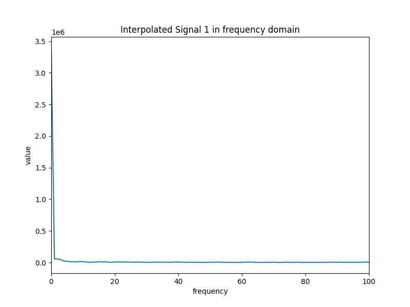
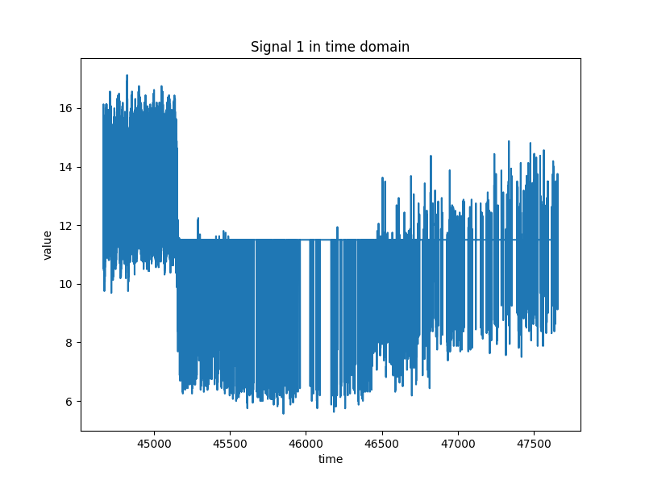

# Opis projektu 
Ten projekt w Pythonie przetwarza sygnały zapisane w pliku .pkl, interpoluje je do określonej częstotliwości próbkowania, a następnie wyświetla zarówno sygnał czasowy, jak i jego widmo częstotliwościowe. Projekt używa bibliotek pickle, pathlib, matplotlib oraz numpy.

## Wymagania
Aby uruchomić ten kod, potrzebujesz następujących bibliotek Python:
- pickle
- pathlib
- matplotlib
- numpy

## Opis działania skryptu
<strong>1. Ładowanie danych:</strong>
Skrypt ładuje dane z pliku 2aHc688_ICP.pkl za pomocą biblioteki pickle.

<strong> 2. Przetwarzanie sygnału: </strong>
Pobiera dane sygnału, częstotliwość próbkowania, flagę błędu oraz czas rozpoczęcia.
Oblicza okres próbkowania oraz czas zakończenia sygnału.
Tworzy tablice czasowe dla oryginalnych i interpolowanych sygnałów.
Interpoluje sygnał do pożądanej częstotliwości próbkowania (100 Hz).
Przeprowadza transformację Fouriera na interpolowanym sygnale.

<strong> 3. Wizualizacja: </strong> 
Rysuje wykresy oryginalnego sygnału w dziedzinie czasu.
Rysuje wykresy interpolowanego sygnału w dziedzinie czasu.
Rysuje wykres modułu wartości transformaty Fouriera interpolowanego sygnału w dziedzinie częstotliwości.

## Przykładowe wyniki

### <strong> Sygnał w dziedzinie czasu </strong>

### <strong> Interpolowany sygnał w dziedzinie czasu </strong>

### <strong> Widmo częstotliwościowe interpolowanego sygnału </strong>

